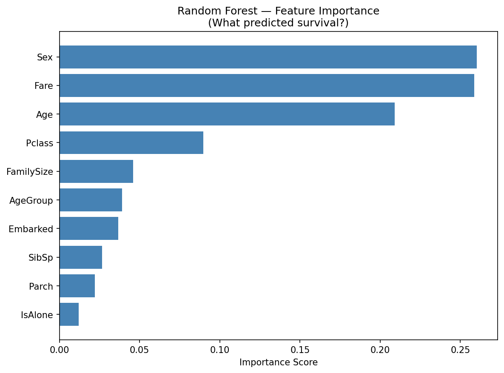
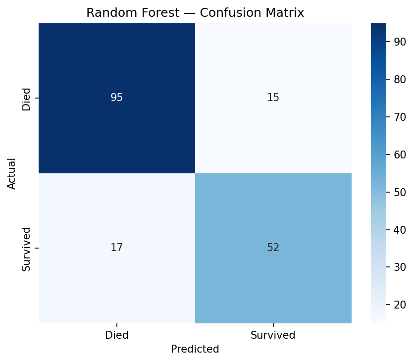
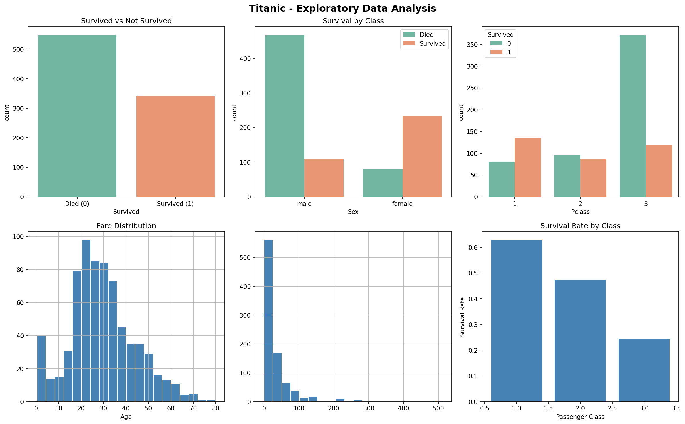

# 🚢 Titanic Survival Predictor







A Machine Learning project that predicts whether a passenger would survive the Titanic disaster using classification algorithms and feature engineering.

---

## 📌 Project Overview

This project uses the famous Titanic dataset to:

* Perform Exploratory Data Analysis (EDA)
* Clean and preprocess data
* Engineer meaningful features
* Train multiple Machine Learning models
* Compare model performance
* Visualize confusion matrix & feature importance
* Predict survival probability for new passengers

The project demonstrates a complete end-to-end ML workflow using Python and Scikit-learn.

---

# 📊 Exploratory Data Analysis

The dataset was analyzed to understand:

* Passenger survival distribution
* Survival by passenger class
* Gender-wise survival patterns
* Correlation between features

---

# 🧹 Data Cleaning & Feature Engineering

## ✔ Data Cleaning

* Removed unnecessary columns:

  * `PassengerId`
  * `Name`
  * `Ticket`
  * `Cabin`

* Filled missing values:

  * `Age` → Median
  * `Embarked` → Mode

* Encoded categorical features:

  * `Sex`
  * `Embarked`

---

## ⚙ Feature Engineering

Created new features:

| Feature    | Description                  |
| ---------- | ---------------------------- |
| FamilySize | Total family members onboard |
| IsAlone    | Whether passenger was alone  |
| AgeGroup   | Categorized age groups       |

---

# 🤖 Models Used

Three machine learning models were trained and compared:

| Model               | Description                         |
| ------------------- | ----------------------------------- |
| Logistic Regression | Linear classification model         |
| Decision Tree       | Rule-based tree classifier          |
| Random Forest       | Ensemble model using multiple trees |

---

# 📈 Model Evaluation

The following metrics were used:

* Accuracy Score
* ROC-AUC Score
* Confusion Matrix
* Cross Validation

---

# 🔥 Confusion Matrix

The confusion matrix shows:

* True Positives
* True Negatives
* False Positives
* False Negatives


---

# ⭐ Feature Importance

Random Forest feature importance was used to determine which features affected survival the most.

Important findings:

* Gender was highly important
* Passenger class strongly affected survival
* Fare and age also influenced predictions


---

# 🧪 Cross Validation

5-Fold Cross Validation was performed to get a more reliable estimate of model performance.

The model achieved:

* Stable accuracy across folds
* Low variance
* Good generalization ability

---

# 🎯 Sample Predictions

The trained model predicts survival probability for new passengers.

### Example Predictions

| Passenger                      | Prediction      |
| ------------------------------ | --------------- |
| 19-year-old male in 3rd class  | DID NOT SURVIVE |
| 30-year-old woman in 1st class | SURVIVED        |

---

# 🛠 Technologies Used

* Python
* Pandas
* NumPy
* Matplotlib
* Seaborn
* Scikit-learn
* Jupyter Notebook

---

# 📂 Project Structure

```bash
Titanic_Survival_Predictor/
│
├── Titanic_Predictor.ipynb
├── train.csv
├── eda.png
├── confusion_matrix.png
├── feature_importance.png
├── README.md
└── requirements.txt
```

---

# ▶️ How to Run

## 1️⃣ Clone Repository

```bash
git clone <your-repo-link>
cd Titanic_Survival_Predictor
```

## 2️⃣ Install Dependencies

```bash
pip install -r requirements.txt
```

## 3️⃣ Run Notebook

```bash
jupyter notebook
```

Open:

```bash
Titanic_Predictor.ipynb
```

---

# 📌 Future Improvements

* Hyperparameter tuning
* Deployment using Streamlit/Flask
* Advanced feature engineering
* XGBoost implementation
* Model explainability using SHAP

---

# 📖 Key Learnings

This project helped in understanding:

* Data preprocessing
* Feature engineering
* Classification models
* Model evaluation metrics
* Cross validation
* Visualization techniques
* Real-world ML workflow

---

# 📜 License

This project is licensed under the MIT License.

```text
MIT License

Copyright (c) 2026 Anay Duggal

Permission is hereby granted, free of charge, to any person obtaining a copy
of this software and associated documentation files (the "Software"), to deal
in the Software without restriction, including without limitation the rights
to use, copy, modify, merge, publish, distribute, sublicense, and/or sell
copies of the Software, and to permit persons to whom the Software is
furnished to do so, subject to the following conditions:

The above copyright notice and this permission notice shall be included in all
copies or substantial portions of the Software.

THE SOFTWARE IS PROVIDED "AS IS", WITHOUT WARRANTY OF ANY KIND, EXPRESS OR
IMPLIED, INCLUDING BUT NOT LIMITED TO THE WARRANTIES OF MERCHANTABILITY,
FITNESS FOR A PARTICULAR PURPOSE AND NONINFRINGEMENT. IN NO EVENT SHALL THE
AUTHORS OR COPYRIGHT HOLDERS BE LIABLE FOR ANY CLAIM, DAMAGES OR OTHER
LIABILITY, WHETHER IN AN ACTION OF CONTRACT, TORT OR OTHERWISE, ARISING FROM,
OUT OF OR IN CONNECTION WITH THE SOFTWARE OR THE USE OR OTHER DEALINGS IN THE
SOFTWARE.
```

---

# 👨‍💻 Author

**Anay Duggal**

If you liked this project, feel free to ⭐ the repository.
